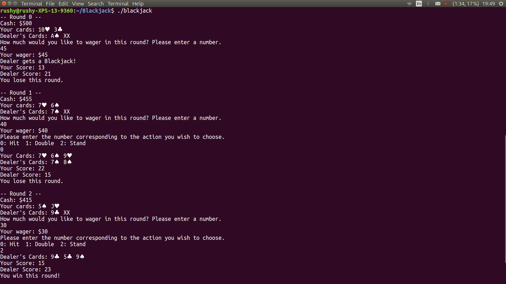

## Single Player Blackjack on the Terminal
---
#### About
Hit or Stand! The aim of Blackjack is to beat the Dealer's score by drawing a greater hand under 21. In this version of the game, the player 
starts off with $500 and can decide between 3 moves - Hit, Stand, or Double - in each round. 

#### Playing The Game
The game can be played with minimal dependencies on any linux or mac platform. To run the game, follow the instructions below:

1. Clone the project

`https://github.com/mrushyendra/blackjack.git`

2. Run Make

`make blackjack`

3. Run the game

`./blackjack`

4. Your game should be running. Enter the appropriate inputs as prompted.

That's it!

#### Under The Hood
This game is entirely written in C++14, and makes liberal use of the Standard Template Library (STL) and objected-oriented features of C++.
Code is split into various standalone components to make it both extensible and easily modifiable, if one wished to play other card games 
in the future instead. The Player and Dealer are both superclasses of an Agent class, which contains methods and member variables that allows one
to move cards between one's hand and the shared Deck appropriately, according to the rules of the game. Game rules are passed to Agents as a
map of `actions`, or function pointers, that allows one to modify the game state. This enables new rules or moves to be easily added with minimal
changes. Tests can be run from a separate test executable also present in the repository, which compares fixed gameplays with expected results.
